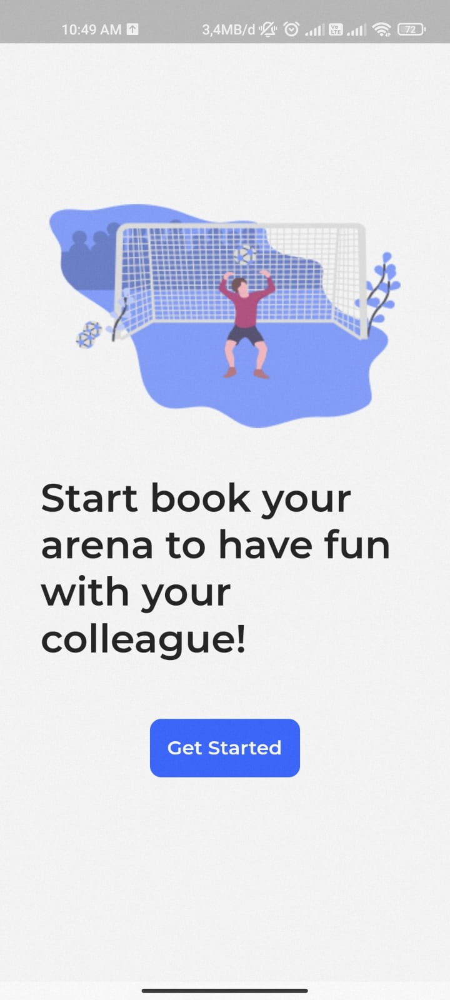
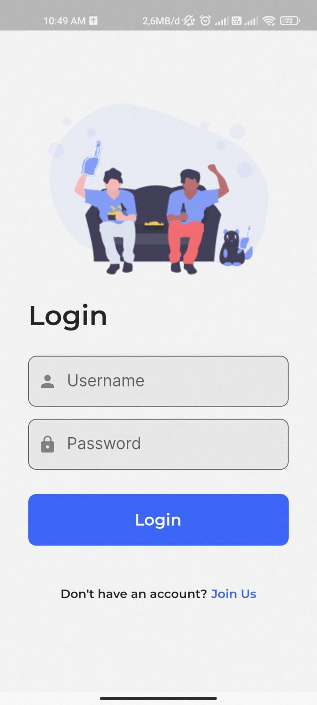
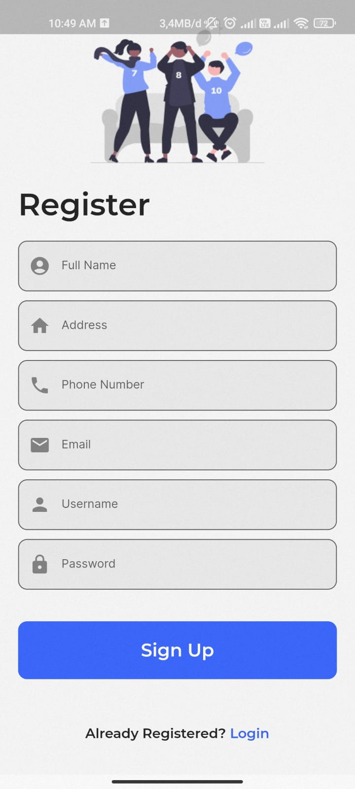
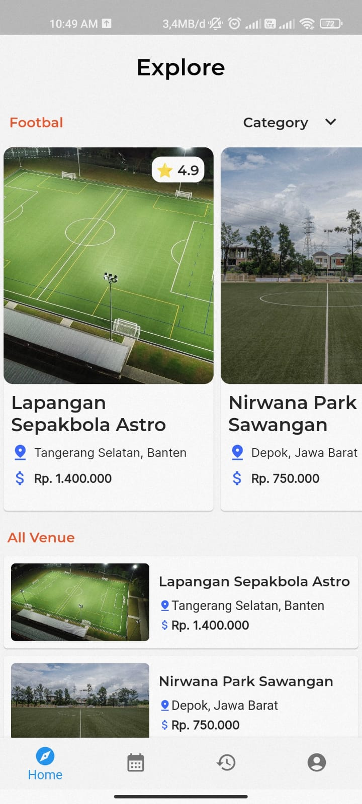
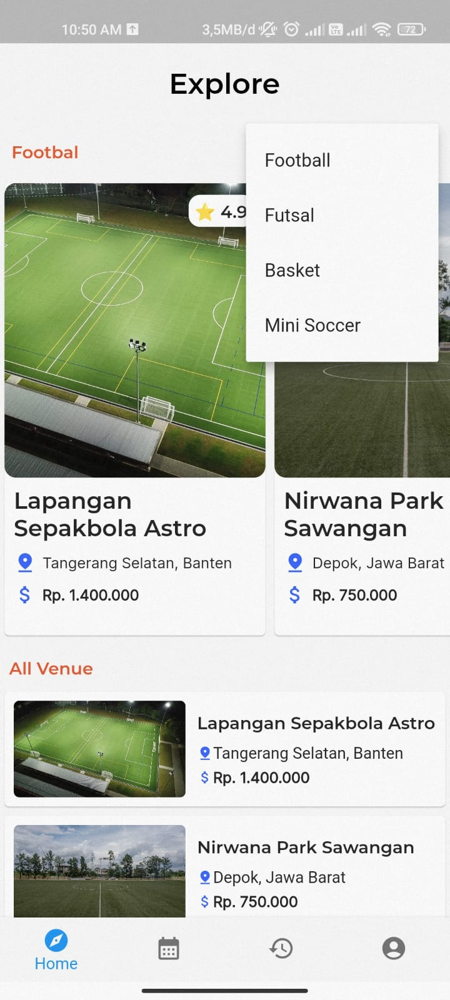
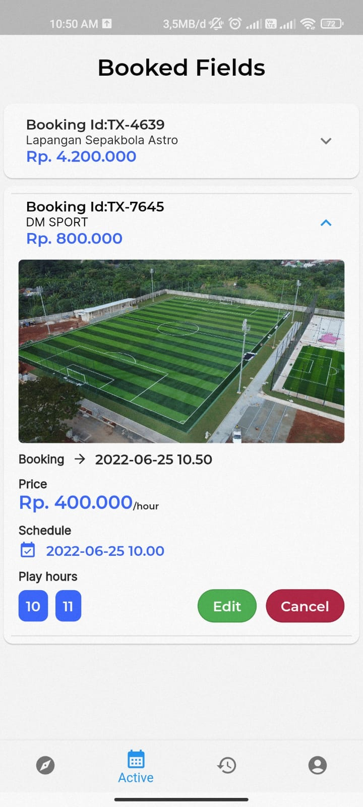
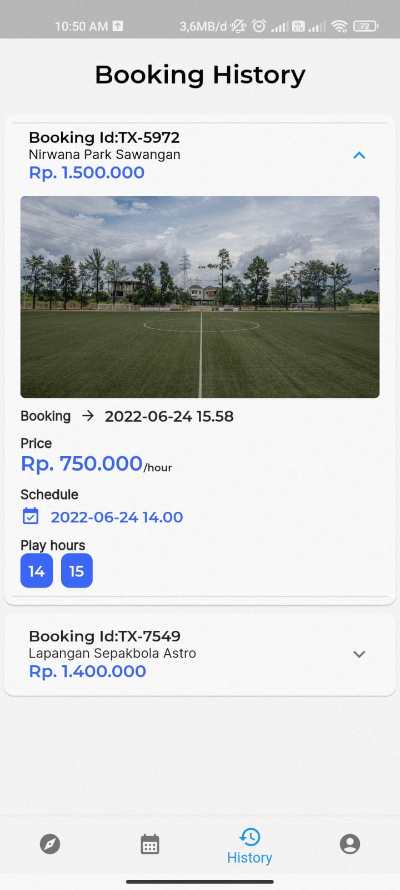
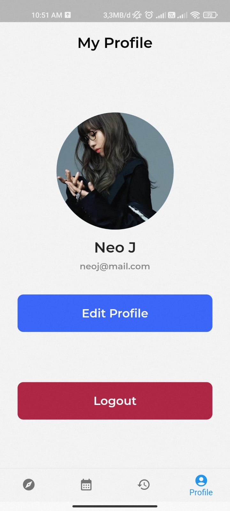
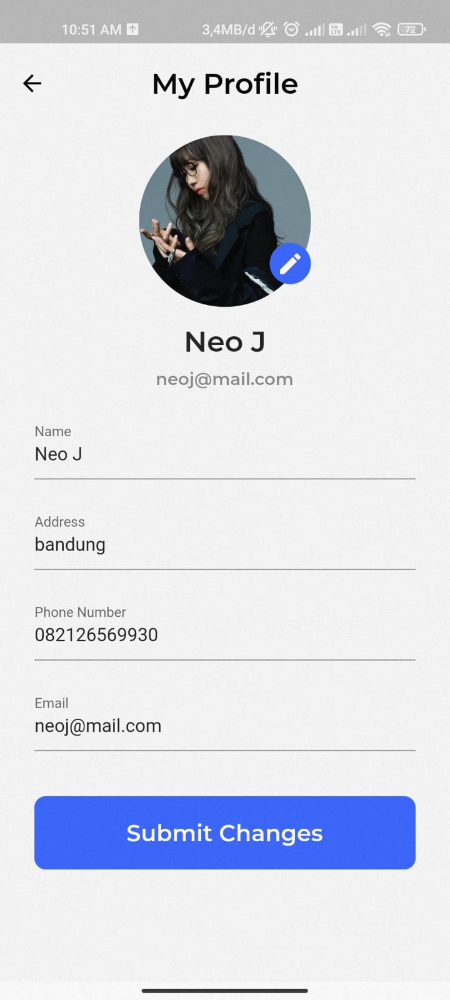

# Sports Field Booking App

UI design by [Rony Wahyu](https://github.com/ronywahyuu).  
Coded by [Me](https://github.com/neojarma).

## App Overview

1. Onboarding Page.  


2. Login Page.  


3. Register Page.  


4. Explore Page.  



5. Booked Fields Page.  


6. History Booking Fields Page.  


7. Profile Page.  




## API Reference

1. [Sports Field Booking API](https://github.com/neojarma/Sports-Fields-Booking)

## Other Resource

1. Venue images [Gelora](https://www.gelora.id/venue)

## Dependencies

1. [Syncfusion Flutter Datepicker](https://pub.dev/packages/syncfusion_flutter_datepicker)
2. [Image Picker](https://pub.dev/packages/image_picker)
3. [Google Fonts](https://pub.dev/packages/google_fonts)
4. [Get](https://pub.dev/packages/get)
5. [Pull To Refresh](https://pub.dev/packages/pull_to_refresh)
6. [intl](https://pub.dev/packages/intl)
7. [Cached Network Image](https://pub.dev/packages/cached_network_image)
8. [Flutter Spinkit](https://pub.dev/packages/flutter_spinkit)

## How To Run
```
1. git clone https://github.com/neojarma/sports-fields-booking-app

2. cd sports-fields-booking-app

3. flutter packages get

4. flutter run
```
